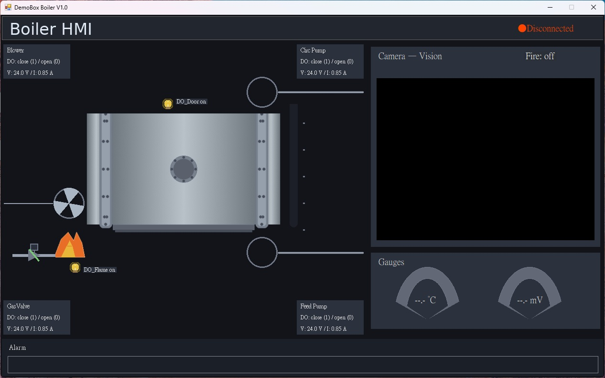

# DemoBox_Boiler

## 專案功能
`DemoBox_Boiler` 是一個以 Windows Forms 建立的鍋爐監控與控制示範程式，整合了 PLC 通訊、現場設備狀態顯示與相機火焰偵測。

主要功能如下：
- 透過 `TwinCAT.Ads` 連接 PLC，讀寫 `GVL.*` 變數（類比值、DO、DI、火焰偵測結果）。
- 以 HMI 形式顯示鍋爐元件狀態（blower、valve、pump、DI 指示）。
- 以 OpenCvSharp 讀取相機影像，執行火焰辨識（顏色 + 動態 + 幾何條件 + 去抖動）。
- 偵測到火焰後在畫面標示並同步回寫 `GVL.bFireDetected`。

## 系統架構

### 1) 啟動層
- `Program.Main()`：程式進入點。
- `NativeBootstrap.EnsureOpenCvNativeReady()`：先將 OpenCvSharp 需要的原生 DLL 釋出到 `%LOCALAPPDATA%\DemoBox_Boiler\native\x64`，並設定 `SetDllDirectory` 與 `PATH`。

### 2) UI / 控制層
- `FormMain`：主視窗與核心流程控制。
- 主要使用多個 `Timer`：
  - `_fanTimer`：blower 動畫更新。
  - `_adsPoll`：週期輪詢 PLC 資料。
  - `_camTimer`：相機擷取與火焰偵測。

### 3) PLC 通訊層
- `AdsClientEx`：對 `AdsClient` 的包裝，提供：
  - 連線 (`Connect`)
  - Handle 管理 (`CreateHandle` / `DeleteHandle`)
  - 讀寫 (`ReadAny` / `WriteAny` / `WriteBool`)
- `FormMain.AdsConnect()`：建立 PLC 變數 handle，啟動輪詢。
- `FormMain.AdsDisconnect()`：釋放 handle、停止輪詢與 UI 狀態復原。

### 4) 視覺偵測層
- `StartCamera()` / `StopCamera()`：控制 `VideoCapture` 生命週期。
- `CamTimer_Tick()`：逐幀讀取影像 -> 呼叫 `DetectFire()` -> `UpdateFireStable()` -> 更新 UI。
- `DetectFire()`：
  - HSV 顏色範圍過濾（紅/橘/黃）
  - 亮度/飽和度條件
  - 與前一幀差分的動態判斷
  - 形態學處理與輪廓幾何過濾
- `UpdateFireStable()`：以連續幀投票 + cooldown 減少誤報與閃爍。

## 執行流程
1. 啟動程式時先執行 `EnsureOpenCvNativeReady()`，確保原生 DLL 可載入。
2. 建立 `FormMain` 並初始化 UI 與計時器事件。
3. 使用者點擊連線區域（`lblAdsState`）觸發 `AdsConnect()`：
   - 嘗試 ADS port `851`，失敗再試 `852`。
   - 建立 `GVL.*` 的 variable handle。
4. `_adsPoll` 週期讀取 PLC 值，更新：
   - gauge / thermometer 類比畫面
   - DO/DI 圖示與資訊卡
5. 使用者點擊相機區域（`pbCameraView`）啟動相機後：
   - `_camTimer` 逐幀偵測火焰
   - UI 顯示偵測框與告警狀態
   - 狀態變更時寫入 `GVL.bFireDetected`
6. 關閉程式時停止所有計時器、關閉相機、解除 ADS 連線並釋放資源。

## 主要檔案
- `Program.cs`：啟動與 OpenCv 原生 DLL bootstrap。
- `Form1.cs`：UI 邏輯、ADS 通訊、相機與火焰偵測核心。
- `Form1.Designer.cs`：Windows Forms 控制項配置。
- `Properties/Resources.resx`：UI 圖像與內嵌 DLL 資源。
- `DemoBox_Boiler.csproj`：目標框架、NuGet 依賴與輸出設定。

## 相依套件與技術
- `.NET Framework 4.8`
- `Windows Forms`
- `OpenCvSharp4`
- `Beckhoff.TwinCAT.Ads`
- `Costura.Fody`（組件打包）

## 注意事項
- 本專案預設以 x64 執行，且需對應的 OpenCV native DLL。
- ADS 連線前請確認 TwinCAT Runtime 已啟動、路由正確、PLC 符號已可讀。
- `GVL` 變數名稱需與 PLC 專案一致，否則會出現 `DeviceSymbolNotFound (0x710)`。
